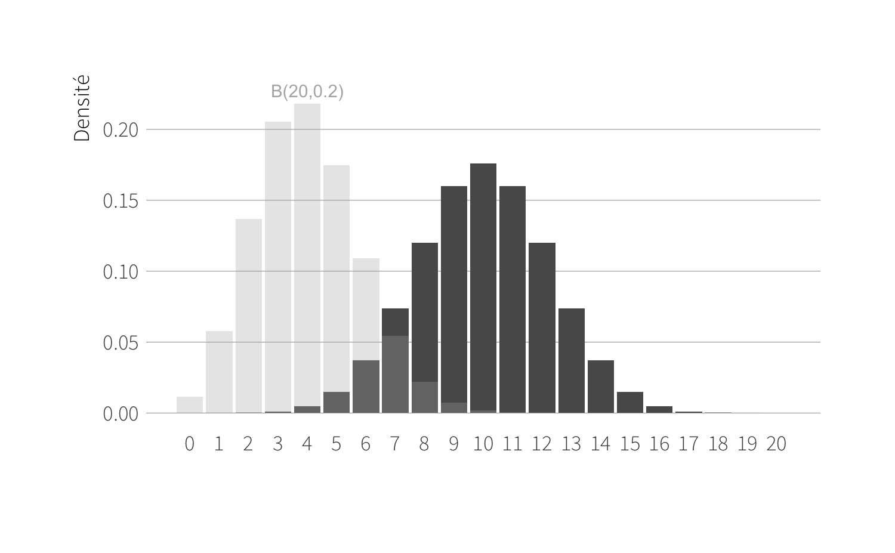

--- 
title: "Tutoriel CanceRopole"
author: "C. Lalanne & S. Charron"
date: "`r Sys.Date()`, rev 0.1"
site: bookdown::bookdown_site
output: bookdown::gitbook
documentclass: book
bibliography: [book.bib, packages.bib]
biblio-style: apalike
link-citations: yes
github-repo: 
url: 'https\://bitbucket.org/chlalanne/rstats-canceropole'
description: "Tutoriel et mémento R pour la formation au logiciel R du Canceropole."
---

# Préface {-}

RITME Academy  
62, rue des Archives  
75010 Paris
